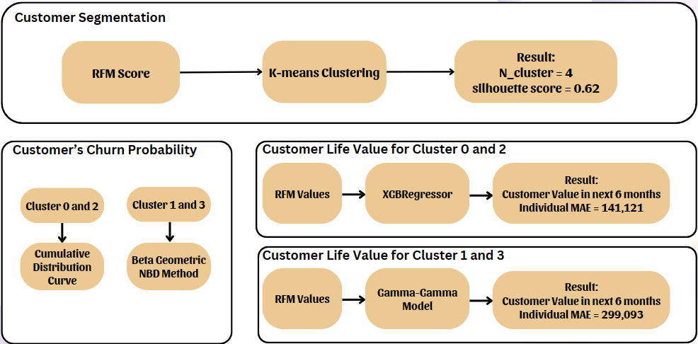

# Portfolio
---
## Data Analyst

### Customer Segmentation Analysis and Churn Prediction

Analyze Pizza Hut's fictitious customer data based on Clusters through RFM Segmentation. Performing Customer Lifetime Value and Churn Probability predictions using Machine Learning and BG/NBD - Gamma-Gamma Model.

 

 

---

### Detect Fraud Transactions using Machine Learning (XGBoost)

Perform Exploratory Data Analysis, analyze and transform data, Feature Engineering and build Machine Learning models to detect fraudulent transactions. My model can detect <b>91.6%</b> of fraudulent transactions.

 

 

---

### Business Growth Strategy Analysis in PowerBI

Analyze data of a fictional company that needs to grow and expand its business using several metrics and time-series analysis. Provide insights and recommendations for the company's growth plan regarding details on the market, time of penetration, target customer profile, etc.

 

 

---

