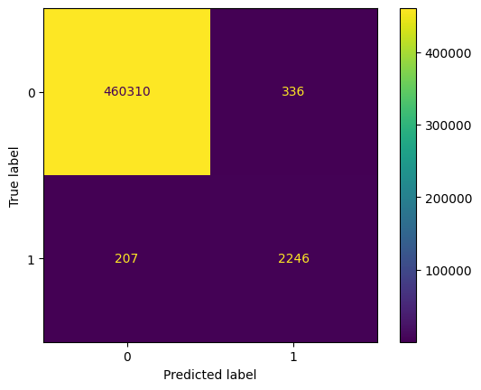

## Portfolio
---
## Data Analyst

### Detect Fraud Transactions using Machine Learning

Perform Exploratory Data Analysis, analyze and transform data, Feature Engineering and build Machine Learning models to detect fraudulent transactions. My model can detect <b>96%<b> of fraudulent transactions.

 

 

---
### RFM Analysis and Segmentation using Python

Perform Exploratory Data Analysis, analyze and transform data, Feature Engineering and build Machine Learning models to detect fraudulent transactions. My model can detect <b>96%<b> of fraudulent transactions.

 

 

---
